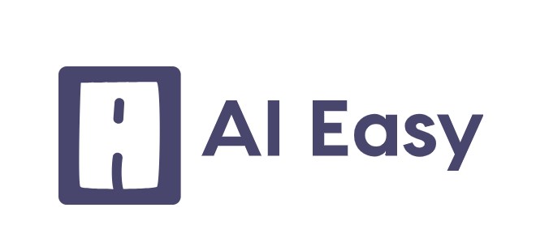

<p align="center">
<br><br>
AI application with a sleek, user-friendly interface, simplifying complex tasks and enhancing productivity.
</p>

## :pushpin: Preview
AI Easy aims to democratize the use of artificial intelligence by providing a high-quality yet minimalistic User Interface. AI Easy is totally compatible and responsive with all type of browsers. We've streamlined all the features and tools you need to be more productive and make your day-to-day life easier. Every component and functionality has been created with at attention to detail, without forgetting the human aspect that drives our goals, to make the user experience as seemleess as possible. 

## :unlock: Features
We've created AI Easy to democratize the use of artificial intelligence, making it accessible for everyone. Whether you're looking to interact with an advanced AI chatbot, generate professional resumes, or create high-quality images, AI Easy has got you covered. The only requirement to tap into these powerful features is basic digital literacy — as a reward, you'll obtain the tools to make your life easier and substantially more productive, all in one platform.

* **AI-Integrated Chat:**  Engage in meaningful conversations with our state-of-the-art AI chatbot, available on all devices. Experience a natural interaction like never before.

* **Cross-Platform:**  AI Easy is designed to work seamlessly on Chrome, Firefox, Safari, Opera, and Edge, and we're continually updating to support more platforms.
  
* **Resume Builder:**  With just a few clicks, generate a professional-grade resume that's sure to stand out. Make the best first impression without the hassle.
  
* **High-Quality Image Generator:**  Utilize AI-powered image creation tools to produce high-quality visuals for all your needs.

* **User-Friendly UI:**  Our minimalist yet robust user interface ensures that you don't need to be a tech expert to navigate through AI Easy.

* **Responsive Design:** Whether you're on mobile, tablet, or desktop, AI Easy adjusts to fit your screen, ensuring an optimal user experience across all devices.

*  **Modern Tech Stack:** We are an open-source application that aim to not only make its functionalities and UI accesible to all, but our codebase and technologies are  head-to-head to the dynamic, high-paced world of web development: our tech stack includes TypeScript, ReactJs, MongoDB and more modern tools to allow developers and software engineers alike to learn and contribute to our project.

* **Clean & Accessible Code:** Following best practices, our code is clean and W3C valid, making it easy for developers to integrate their own features if needed.

## Sponsors

If you share our mission on democratizing all the tools that AI has to offer us, you can sponsor our project here: [Become one of our sponsors](https://opencollective.com/tabler#sponsor)

## Creators

| Creator        | Role                      | GitHub Profile  |
| -------------- | --------------------------|----------------- |
| Pablo          | Senior Front-End Developer| [Pablo](https://github.com/pablo-alm)
| Juan           | Front-End Developer       | [Juan](https://github.com/Juanarielok) |
| José David     | Full-Stack Developer      | [José David](https://github.com/B4LSEROS) |
                    


## Credits
Thank you to all creators and contributors for facilitating and contributing to the democratization of Artificial Intelligence: lack simplicity and accesibility is oftentimes a barrier between AI and non-tech folk; however, AI Easy reduces this gap to make everything easier ❤️


## Installation and Setup Environment
This is a [Next.js](https://nextjs.org/) project bootstrapped with [`create-next-app`](https://github.com/vercel/next.js/tree/canary/packages/create-next-app).

## Getting Started

First, run the development server:

```bash
npm run dev
# or
yarn dev
# or
pnpm dev
```

Open [http://localhost:3000](http://localhost:3000) with your browser to see the result.

You can start editing the page by modifying `app/page.tsx`. The page auto-updates as you edit the file.

This project uses [`next/font`](https://nextjs.org/docs/basic-features/font-optimization) to automatically optimize and load Inter, a custom Google Font

## Learn More

To learn more about Next.js, take a look at the following resources:

- [Next.js Documentation](https://nextjs.org/docs) - learn about Next.js features and API.
- [Learn Next.js](https://nextjs.org/learn) - an interactive Next.js tutorial.

You can check out [the Next.js GitHub repository](https://github.com/vercel/next.js/) - your feedback and contributions are welcome!

## Deploy on Vercel

The easiest way to deploy your Next.js app is to use the [Vercel Platform](https://vercel.com/new?utm_medium=default-template&filter=next.js&utm_source=create-next-app&utm_campaign=create-next-app-readme) from the creators of Next.js.

Check out our [Next.js deployment documentation](https://nextjs.org/docs/deployment) for more details.
